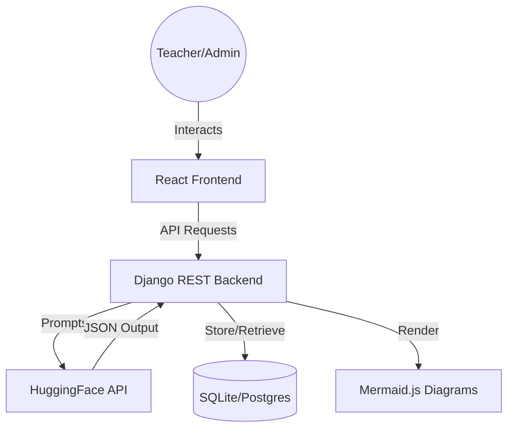

# KTU-QGen 🎓

[](https://github.com/qzgpm/AI-Question-Paper-Generator/actions)
[](LICENSE)
[](https://www.python.org/)
[](https://react.dev/)

**KTU-QGen** is an AI-powered academic question paper generation system designed for university internal examinations. It automates the creation of high-quality, balanced, and syllabus-aligned exam papers using state-of-the-art LLMs.

---

## ✨ Key Features

- **🤖 AI-Powered Generation**: Instantly generate complete question papers from syllabus units using **Llama 3** or **Mistral** via HuggingFace.
- **📊 Intuitive Dashboard**: Track curriculum progress, faculty statistics, and generation history in a clean, monochrome interface.
- **📐 Technical Diagrams**: Native integration with **Mermaid.js** for rendering AI-generated technical diagrams (DFA, NFA, Flowcharts).
- **🛡️ Quality Assurance**:
    - **Originality Check**: AI-driven assessment of textbook copying risk.
    - **Internal Similarity**: Local database checks to prevent duplication.
- **🚀 Dual Modes**: Choose between **Auto-Generation** or **Manual Selection** from an AI-suggested candidate pool.
- **📦 Export Ready**: Clean, academic-style layout optimized for printing and PDF export.

---

## 🛠️ Tech Stack

- **Frontend**: React 19, Vite, Tailwind CSS, Lucide icons.
- **Backend**: Django 5 / 6, Django REST Framework, WhiteNoise.
- **AI Engine**: HuggingFace Inference API (Meta-Llama-3-8B-Instruct).
- **Database**: SQLite (Development) / PostgreSQL (Optional Production).
- **DevOps**: GitHub Actions (CI), Docker, Docker Compose.

---

## 🏗️ Architecture



---

## 🚀 Getting Started

### 🐳 Option 1: Docker (Recommended)
The quickest way to get started is using Docker Compose.

```bash
# Build and start the entire stack
docker-compose up --build
```
The app will be available at `http://localhost:8000`.

### 💻 Option 2: Local Development

#### 1. Backend Setup
```bash
python -m venv venv
source venv/bin/activate
pip install -r requirements.txt
python manage.py migrate
python manage.py runserver
```

#### 2. Frontend Setup
```bash
cd frontend
npm install
npm run dev
```

---

## 🔧 Configuration
Create a `.env` file in the root directory:
```env
HUGGINGFACE_API_KEY=your_hf_key_here
SECRET_KEY=your_django_secret_key
DEBUG=True
```

---

## 🎡 CI/CD
This project uses **GitHub Actions** for:
- **Backend Verification**: Automated Django checks and unit tests.
- **Frontend Validation**: Production build verification on Node.js 24.
- **Automation**: Triggered on every push to `main` or `master`.

---

## 📜 License
Developed for academic purposes under the MIT License.
